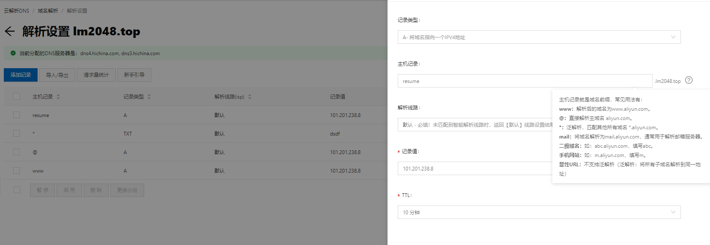
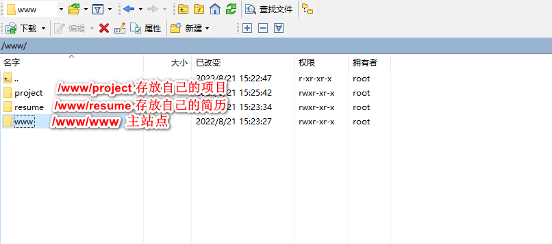

# Nginx简单笔记

* `cd /usr/local/nginx/sbin`,在这个目录下进行命令行操作。

* `usr/local`相当于Windows下C盘的`program file`文件，一般2我们都把应用程序都装在`usr/local`下。

* `sbin`是nginx的主进程文件。

* 我们的首页在：`/usr/local/nginx/html/index.html`，输入网址`lm2048.top`显示的就是这个HTML页面的信息。

* 在阿里云服务器添加二级域名`project.lm2048.top`，方式如下:

  

* 同上，我们继续添加二级域名`resume.lm2048.top`，将其解析到我的GithubPage主页。然后将自己的仓库`lm101845.github.io`里面添加CNAME文件，里面输入resume.lm2048.top，进行解析。

* 添加H5静态文件方式：

  * `cd /`
  * `mkdir www`
  * 在www文件夹下面新建project文件夹，project文件夹下新建staticpage文件夹，里面存放不同的H5静态文件。
  * `cd /usr/local/nginx/conf`进入Nginx配置文件

  

* nginx.conf简单配置如下：

  ~~~
  worker_processes  1;
  
  events {
      worker_connections  1024;
  }
  
  http {
      include       mime.types;
      default_type  application/octet-stream;
      sendfile        on;
      #keepalive_timeout  0;
      keepalive_timeout  65;
      #虚拟主机1 vhost
      server {
          listen       80;
          server_name  localhost;   #域名，主机名 
          location / {
              root   /www/www;   
              #我们在根目录下新建了一个www文件夹，www文件夹下面又建了一个www文件夹，作为它的主站点
              index  index.html index.htm;
          }
          error_page   500 502 503 504  /50x.html;
          location = /50x.html {
              root   html;
          }
      }
  }
  ~~~

* 现在我们演示一下不同端口号的虚拟主机

* 当改完nginx.conf配置后，我们需要重启一下Nginx或者reload一下Nginx。命令为`systemctl reload nginx`，然后看它是否起来了，命令为`status nginx`